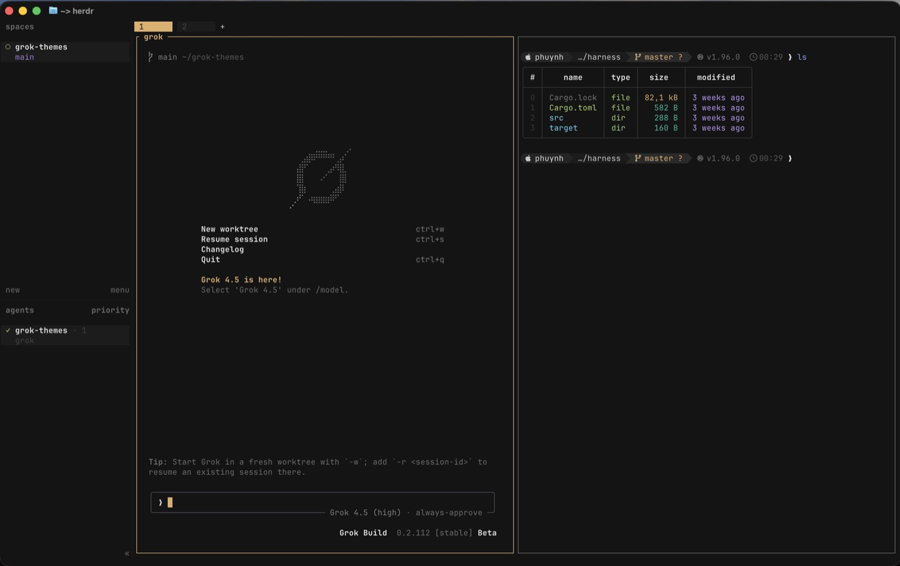

# Grok Themes

Unified **GrokNight** / **GrokDay** themes for everyday tools — Ghostty, Neovim, Nushell, Starship, and Herdr.

Palettes adapted from [xai-org/grok-build](https://github.com/xai-org/grok-build).





## Why this exists

I wanted one visual language across the tools I use every day. Catppuccin was my default for a long time — modern, polished, and widely supported — but the purple and pastel accents never quite felt like me.

GrokNight (from grok-build) does. It’s dark, coherent, and professional. Grok and Cursor are also where I spend most of my time, so I adapted that palette into themes for Ghostty, Neovim, Nushell, Starship, and Herdr to keep a consistent look across the stack.

## Layout

```
palette.toml           # reference palettes (night + day)
palette.css            # CSS variables for both
ghostty/grok-night     # Ghostty dark
ghostty/grok-day       # Ghostty light
neovim/                # Neovim colorscheme plugin (Lua)
  colors/              #   :colorscheme grok-night | grok-day
  lua/grok/            #   palette + highlight groups
  lua/lualine/themes/  #   lualine themes
nushell/grok-night.nu  # Nushell syntax / table colors
nushell/grok-day.nu
starship/starship.toml # muted powerline (default: grok_night)
herdr/grok-night.toml  # Herdr UI theme snippet (dark)
herdr/grok-day.toml    # Herdr UI theme snippet (light)
herdr/powerline-branch # Herdr plugin: $pl_branch =  name
```

## Install

### Ghostty

```sh
mkdir -p ~/.config/ghostty/themes
cp ghostty/grok-night ghostty/grok-day ~/.config/ghostty/themes/
```

In `~/.config/ghostty/config`:

```
theme = light:grok-day,dark:grok-night
```

Or force dark:

```
theme = grok-night
```

Reload with `Cmd+Shift+,` (macOS).

### Neovim

The `neovim/` folder is a local plugin (Tree-sitter, LSP, LazyVim-friendly plugins, lualine).

**Lazy.nvim / LazyVim** — add a plugin file (e.g. `~/.config/nvim/lua/plugins/grok.lua`):

```lua
return {
  {
    dir = vim.fn.expand("~/Workspace/grok-themes/neovim"),
    name = "grok",
    lazy = false,
    priority = 1000,
    config = function()
      require("grok").setup({
        style = "night", -- or "day"
        transparent = false,
        terminal_colors = true,
        italic_comments = true,
      })
      vim.cmd.colorscheme("grok-night")
      -- vim.cmd.colorscheme("grok-day")
    end,
  },
  -- Optional: lualine (theme ships with the plugin)
  {
    "nvim-lualine/lualine.nvim",
    opts = function(_, opts)
      opts.options = opts.options or {}
      opts.options.theme = "grok-night" -- or "grok-day"
    end,
  },
}
```

Disable or remove your previous colorscheme plugin (e.g. Catppuccin) so it does not override Grok.

**Manual path** (no plugin manager):

```sh
# symlink into Neovim runtime
mkdir -p ~/.config/nvim/colors ~/.config/nvim/lua
ln -sf ~/Workspace/grok-themes/neovim/colors/grok-night.lua ~/.config/nvim/colors/
ln -sf ~/Workspace/grok-themes/neovim/colors/grok-day.lua ~/.config/nvim/colors/
ln -sf ~/Workspace/grok-themes/neovim/lua/grok ~/.config/nvim/lua/grok
# optional lualine
mkdir -p ~/.config/nvim/lua/lualine/themes
ln -sf ~/Workspace/grok-themes/neovim/lua/lualine/themes/*.lua ~/.config/nvim/lua/lualine/themes/
```

Then in `init.lua` / options:

```lua
vim.cmd.colorscheme("grok-night")
```

### Nushell

```sh
mkdir -p "$HOME/Library/Application Support/nushell/themes"
cp nushell/*.nu "$HOME/Library/Application Support/nushell/themes/"
```

In `config.nu`:

```nu
source ($nu.default-config-dir | path join "themes/grok-night.nu")
```

Use `grok-day.nu` for the light variant.

### Starship

```sh
cp starship/starship.toml ~/.config/starship.toml
```

Default palette is `grok_night`. For light mode, set:

```toml
palette = 'grok_day'
```


### Herdr

Herdr has no standalone theme files — merge a snippet into `~/.config/herdr/config.toml`:

```sh
# preview
cat herdr/grok-night.toml
```

Copy the `[theme]`, `[theme.custom]`, `[ui]`, and `[ui.sidebar.spaces]` values from `herdr/grok-night.toml` (or `grok-day.toml`) into your config, then reload:

```sh
herdr server reload-config
```

The space sidebar styles the branch like Starship powerline: yellow text plus the `` glyph. Herdr’s built-in `branch` token is name-only (and mauve by default), so the theme uses a custom `$pl_branch` token filled by a small plugin:

```sh
herdr plugin link "$(pwd)/herdr/powerline-branch"
# or after clone, path to herdr/powerline-branch
herdr plugin action invoke grok.powerline-branch.refresh
herdr server reload-config
```

Without the plugin, switch the spaces row back to the built-in token:

```toml
[{ token = "branch", fg = "#e0af68" }, { token = "git_status", fg = "#ff9e64" }]
```

## Palettes

| Token        | GrokNight | GrokDay   |
|--------------|-----------|-----------|
| Background   | `#141414` | `#eeeeee` |
| Foreground   | `#e1e1e1` | `#262626` |
| Magenta      | `#bb9af7` | `#7D4BC6` |
| Blue         | `#7aa2f7` | `#2F64D2` |
| Cyan         | `#7dcfff` | `#0082AA` |
| Green        | `#9ece6a` | `#378E23` |
| Red          | `#f7768e` | `#CD3048` |
| Orange       | `#ff9e64` | `#C3691E` |
| Yellow       | `#e0af68` | `#A27612` |
| Teal         | `#1abc9c` | `#0A8E70` |

Full tokens live in [`palette.toml`](./palette.toml) and [`palette.css`](./palette.css).

## License

Themes are derived from grok-build’s public palette definitions. Use freely for personal config.
